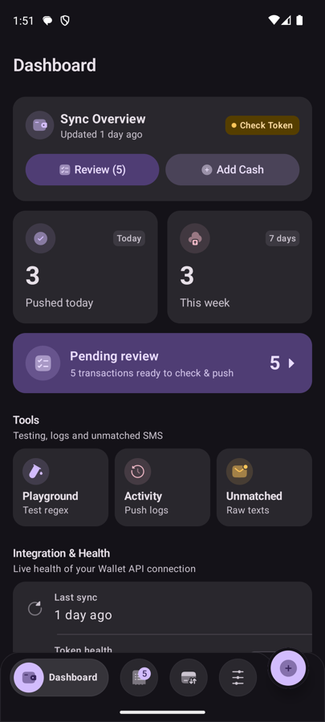
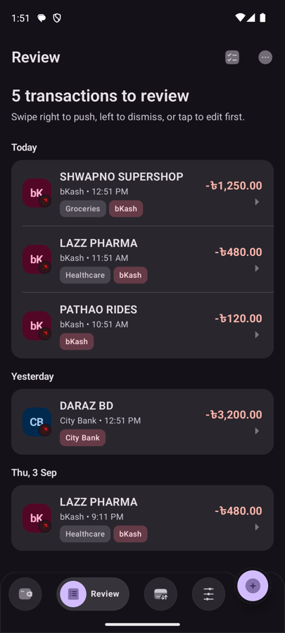
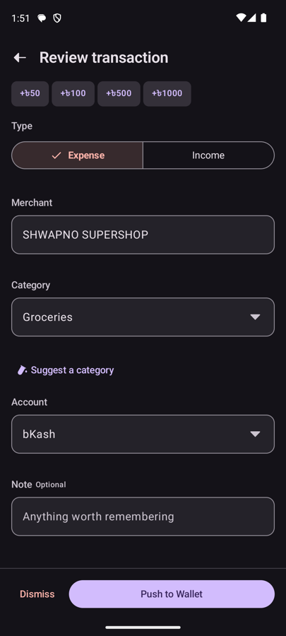
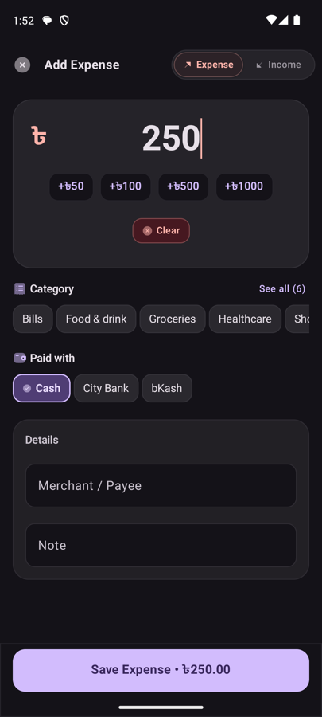
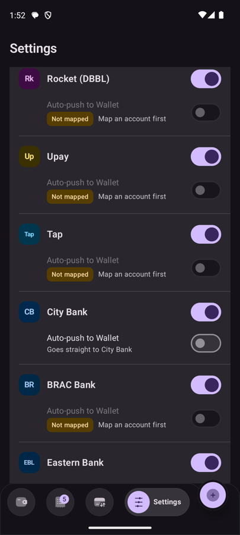
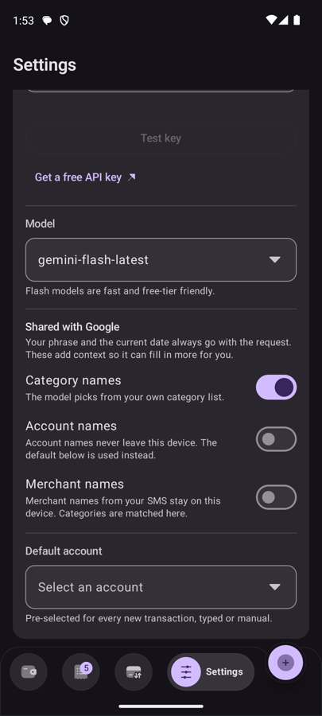

# SMS2Wallet

Reads Bangladeshi bank and mobile-financial-service transaction SMS on your phone,
parses them on-device, and pushes them into [Wallet by BudgetBakers](https://web.budgetbakers.com)
through its REST API — so you stop typing transactions by hand.

> Independent, unaffiliated client of the BudgetBakers public API.
> Requires a Wallet **Premium** subscription, since API tokens are a Premium feature.

---

## Screenshots

<!-- markdownlint-disable MD033 -->
<table>
  <tr>
    <td align="center" width="33%">
      <br>
      <sub><b>Dashboard</b><br>Counters, pending review, connection health</sub>
    </td>
    <td align="center" width="33%">
      <br>
      <sub><b>Review queue</b><br>Grouped by day; swipe to push or dismiss</sub>
    </td>
    <td align="center" width="33%">
      <br>
      <sub><b>Review a transaction</b><br>Edit anything, or ask for a category</sub>
    </td>
  </tr>
  <tr>
    <td align="center" width="33%">
      <br>
      <sub><b>Add cash</b><br>One-tap categories and accounts</sub>
    </td>
    <td align="center" width="33%">
      <br>
      <sub><b>Parsers</b><br>Auto-push stays locked until mapped</sub>
    </td>
    <td align="center" width="33%">
      <br>
      <sub><b>Intelligence</b><br>You choose what is shared</sub>
    </td>
  </tr>
</table>

<sub>Screenshots use synthetic demo data, not real transactions.</sub>
<!-- markdownlint-enable MD033 -->

---

## How it works

```text
incoming SMS
    │
    ▼
 parse on-device ──► no match ──► Unmatched SMS  (inspect, test, dismiss)
    │
    ▼
 fill in what it can
   • account   from your provider → Wallet account mapping
   • category  from learned rules, then a built-in merchant table
    │
    ├── provider set to auto-push ──► queued ──► Wallet
    │
    └── otherwise ──────────────────► Review queue ──► you confirm ──► Wallet
```

Everything up to the final step happens on your device. Only the resulting transaction
is sent to BudgetBakers.

---

## Features

### Parsing

Handles SMS from **9 providers** — bKash, Nagad, Rocket, Upay, Tap, City Bank, BRAC Bank,
Eastern Bank (EBL) and Mutual Trust Bank (MTB) — via the
[bd-sms-parsers](https://github.com/ajshovon/bd-sms-parsers) library.

Each provider has two independent switches: whether it is parsed at all, and whether its
transactions push automatically or wait for review. Auto-push is off by default and stays
disabled until you have mapped that provider to a Wallet account, so a transaction can
never be sent somewhere you did not choose.

Messages no parser recognises are kept under **Activity → Unmatched SMS**, where you can
read them, try them in the Playground, or dismiss them.

### Review queue

Anything not auto-pushed lands in a queue grouped by day. From there you can:

- Open a transaction to edit its amount, direction, merchant, category, account and note
- Swipe to push or dismiss — or use the equivalent actions from the row's menu,
  which are also exposed to screen readers
- Multi-select for bulk push or dismiss
- Dismiss everything at once, behind a confirmation that names the exact count

Rows flagged as suspected duplicates or needing verification are called out rather than
mixed in silently.

### Never creates duplicates

The Wallet API has no idempotency key and no client-supplied record ID, so re-posting the
same transaction silently creates a second record. SMS2Wallet defends in three layers:

1. **Ingest dedup** — a unique index on a hash of the SMS means the same message can never
   be parsed into two rows, however many times you rescan.
2. **A send state machine** — a row moves to `SENDING` *before* the HTTP call, and only
   `QUEUED` rows are eligible to send. A crash mid-push can never re-send on restart.
3. **Reconciliation** — when a connection drops mid-flight the outcome is genuinely unknown.
   Rather than retry blindly, the app queries Wallet for a matching record written by this
   integration and adopts it if found.

States a transaction can be in: `PARSED`, `QUEUED`, `SENDING`, `PUSHED`, `FAILED_RETRYABLE`,
`FAILED_PERMANENT`, `NEEDS_VERIFY`, `DISMISSED`.

### Account mapping

Map each SMS source — a provider, optionally narrowed to the last four digits of an account —
to a Wallet account. Mappings are matched exactly first, then by provider, so a mapping saved
without a last-4 still covers every message from that provider.

Transactions ingested *before* a mapping existed pick it up when you open them, rather than
staying blank forever.

### Categories

Category is resolved in order, stopping at the first answer:

| Order | Source | Cost |
| --- | --- | --- |
| 1 | **Learned rules** — remembered when you push a transaction | free, offline |
| 2 | **Built-in merchant table** — Bangladeshi chains and generic terms | free, offline |
| 3 | **Gemini** — only if you enable it, only for merchants 1 and 2 cannot answer | one API call |
| 4 | The mapped account's default category | free, offline |

**Learned categories** are the important part. When you confirm and push a transaction, the
merchant → category pairing is remembered, so the next transaction from that shop is filled
in instantly and offline. Learning happens on *your confirmation*, never on a suggestion —
otherwise a single wrong guess would teach itself and repeat. Everything it has learned is
listed under **Settings → Learned categories**, and any entry can be deleted.

Merchant keywords are normalised, so `SHWAPNO SUPERSHOP DHANMONDI 4412` is stored as
`SHWAPNO SUPERSHOP` and still matches next month.

### Intelligence (optional, brings your own key)

Off by default. Needs a free [Google Gemini API key](https://aistudio.google.com/apikey),
stored encrypted on the device. Two things use it:

**Add a transaction by typing it.** A box on the Dashboard turns `uber 120` into an amount,
a direction, a merchant and a category, then opens the add screen pre-filled. It never saves
on its own — a language model is not certain, and money written to your real ledger on the
strength of a guess is the one thing that cannot be taken back.

**Suggest a category.** Under the Category field on any transaction, and as
*Suggest missing categories* in the review queue's overflow menu. The bulk version handles
the whole queue in **one** request, de-duplicated by merchant, so ten rows from the same shop
cost one entry rather than ten.

Both are constrained by a response schema built from your own category and account names, so
the model cannot return a category you do not have. When it is not confident it returns
nothing — an omission costs one tap, a confident wrong answer gets filed as fact.

Models available: `gemini-flash-latest`, `gemini-flash-lite-latest`, `gemini-2.5-flash`.

### Notifications

Two channels, deliberately separate:

| Channel | Importance | Why |
| --- | --- | --- |
| Transactions to review | Default | It is a task — tapping opens that transaction's edit screen |
| Auto-pushed transactions | Low | It is a receipt — there is nothing to act on |

Notification IDs are the transaction ID, so re-scanning your inbox replaces a notification
rather than stacking duplicates.

### Reminders

A configurable daily nudge to log cash spending that never produced an SMS, with a quick-add
sheet. Skips itself when you have already logged enough that day.

### Appearance

- **Themes** — System, Light, Dark, and AMOLED true-black
- **Accent** — Dynamic (wallpaper palette on Android 12+), Brand, Blue, Violet, Rose, Amber,
  Forest. The chosen seed generates the whole Material 3 tonal palette.
- Duotone icon set, 48dp touch targets, screen-reader labels and live regions throughout,
  and layouts that hold up at large font scales.

### Tools

- **Parser Playground** — paste any SMS and see exactly what the parsers make of it
- **Activity** — a log of every push attempt and its outcome
- **Unmatched SMS** — messages no parser recognised
- **Wallet catalogue sync** — accounts and categories are cached locally so pickers work
  offline; the Dashboard shows how stale that cache is and lets you refresh it
- **API budget** — the Wallet API allows 300 requests/hour; the Dashboard shows what is left

---

## Getting started

1. **Install** the APK and grant SMS permissions when asked.
2. **Connect Wallet** — Settings → Wallet connection. Paste your BudgetBakers API token and
   tap *Test connection*. A first-ever token may report that a sync is in progress; that is
   expected, wait and retry.
3. **Sync your catalogue** — pulls your accounts and categories so the pickers have something
   to offer.
4. **Map your providers** — Settings → Account mapping. Until a provider is mapped, its
   transactions cannot auto-push.
5. **Optionally enable Intelligence** — Settings → Intelligence, add a Gemini API key.

---

## Privacy

Everything is processed on your device unless you turn something on.

| Data | Where it goes |
| --- | --- |
| SMS bodies | Never leave the device. Parsed locally; only the resulting transaction is sent. |
| Transactions | To BudgetBakers, when pushed — that is the point of the app. |
| Wallet API token | Encrypted with a hardware-backed Android Keystore key. Sent only as the `Authorization` header to BudgetBakers. |
| Gemini API key | Same encrypted store. Sent only as a header to Google. |

If you enable Intelligence, you control exactly what accompanies a request:

| Shared with Google | Default | If you leave it off |
| --- | --- | --- |
| Your typed phrase + current date | always, when you use the feature | — |
| Category names | **on** | Categories are matched on-device from the merchant name instead |
| Account names | **off** | Your chosen default account is used |
| Merchant names from SMS | **off** | Only learned rules and the built-in table assign categories |

Neither client logs a request body, and both redact their credentials from headers before
anything reaches logcat.

The SMS receiver is guarded by `android:permission="android.permission.BROADCAST_SMS"`, which
only the system holds — so another app cannot inject fake transaction messages into it.

---

## Permissions

| Permission | Why |
| --- | --- |
| `READ_SMS`, `RECEIVE_SMS` | Read transaction SMS. Parsed on-device. |
| `INTERNET` | Talk to the Wallet API, and Gemini if you enable it. |
| `POST_NOTIFICATIONS` | Reminders and review prompts. |
| `SCHEDULE_EXACT_ALARM` | Fire the reminder at the time you picked. Optional — without it reminders still work, just within about 15 minutes. |
| `RECEIVE_BOOT_COMPLETED` | Re-schedule reminders after a reboot. |

---

## Building

Requires JDK 21 and the Android SDK (compileSdk 36). Minimum supported device: **Android 8.0**
(API 26).

```bash
git clone --recurse-submodules https://github.com/ajshovon/sms2wallet.git
cd sms2wallet
./gradlew :app:assembleDebug
```

Already cloned without submodules? `git submodule update --init --recursive`.

Tests:

```bash
./gradlew :app:testDebugUnitTest :bd-sms-parsers:test
```

Signed release builds read `RELEASE_STORE_FILE`, `RELEASE_STORE_PASSWORD`, `RELEASE_KEY_ALIAS`
and `RELEASE_KEY_PASSWORD` from `local.properties` or the environment. Without them,
`assembleRelease` produces an unsigned APK.

> Do not put `org.gradle.java.home` in the tracked `gradle.properties` — an absolute path there
> fails the build on every other machine, including CI. Machine-specific JDK selection belongs
> in `~/.gradle/gradle.properties`.

---

## Architecture

Single-module Android app, Kotlin + Jetpack Compose.

| Layer | What lives there |
| --- | --- |
| `data/sms` | Broadcast receiver, inbox scanner, ingest pipeline |
| `data/local` | Room database, DAOs, entities |
| `data/remote` | Ktor clients for the Wallet API and Gemini |
| `data/push` | Send state machine, reconciler, WorkManager worker |
| `data/prefs` | DataStore settings, Keystore-encrypted secrets |
| `domain` | Push-state rules, category resolution, prompts, label disambiguation |
| `presentation` | Compose screens, view models, design system |

Hilt for dependency injection, WorkManager for background push, kotlinx.serialization for
JSON. The design system lives in `presentation/theme` — spacing, sizing, shape, motion and
colour tokens, used instead of literal values at call sites.

---

## License

GNU AGPL-3.0 — see [LICENSE](LICENSE) and [NOTICE](NOTICE).
